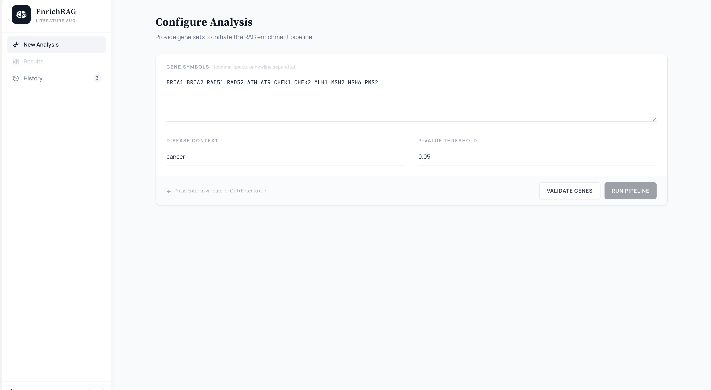
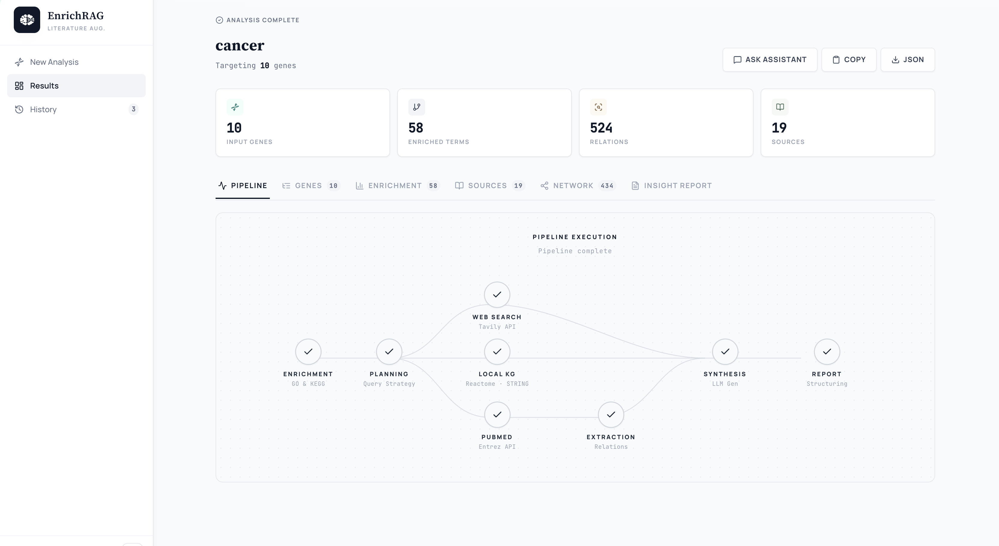
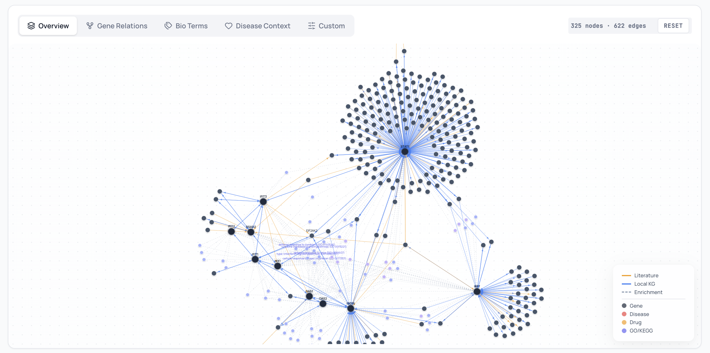
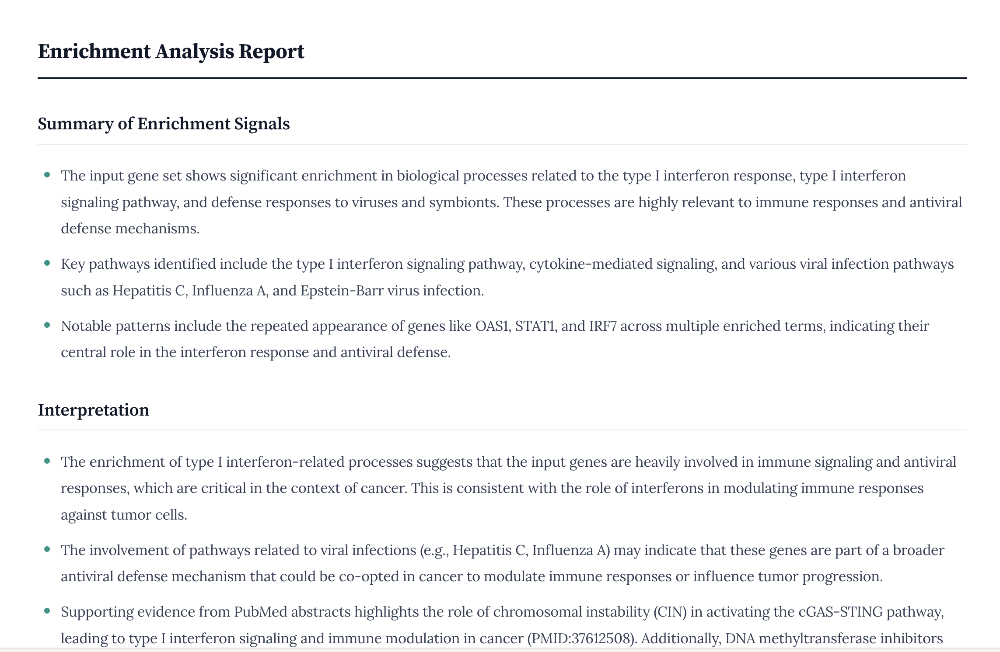
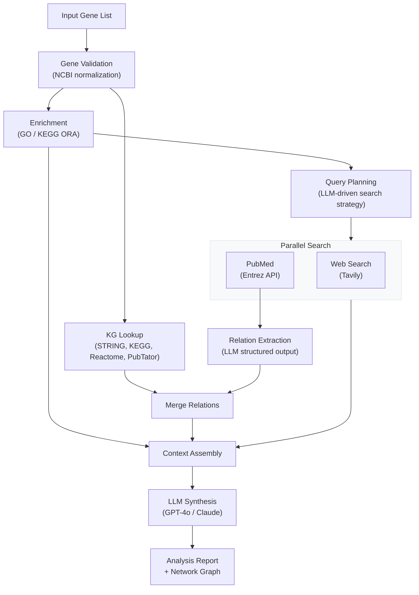

# EnrichRAG

> Gene set enrichment extended with knowledge graph retrieval, literature augmentation, and LLM-based interpretation.

From a gene list, EnrichRAG runs canonical enrichment (GO/KEGG), queries a local knowledge graph (STRING, KEGG, Reactome, PubTator), searches PubMed and the web, extracts biomedical relations with an LLM, and synthesizes everything into a narrative report — all streamed to a Vue 3 frontend in real time.

### Input — configure gene set and disease context

<p align="center">
  
</p>

Enter gene symbols (comma, space, or newline separated), specify the disease context and p-value threshold, then run the full pipeline with one click.

### Pipeline — real-time streaming execution

<p align="center">
  
</p>

Each step streams progress via SSE — enrichment, query planning, parallel web/PubMed search, local KG lookup, relation extraction, and LLM synthesis — with animated node states and per-step timers.

### Network — interactive knowledge graph

<p align="center">
  
</p>

D3 force-directed graph combining local KG relations (STRING, KEGG, Reactome, PubTator), literature-extracted relations, and enrichment term links. Five presets (Overview, Gene Relations, Bio Terms, Disease Context, Custom) with hierarchical relation-type filters.

### Report — LLM-synthesized analysis

<p align="center">
  
</p>

Narrative report integrating enrichment signals, extracted relations, and literature evidence — with PMID citations, pathway interpretation, and novel hypothesis generation.

## Quick Start

```bash
# 1. Configure
cp .env.example .env          # fill in OPENAI_API_KEY, TAVILY_API_KEY, PUBMED_EMAIL

# 2. Install
uv sync                       # Python deps
cd frontend && npm i           # Frontend deps

# 3. Build knowledge graph (first time, ~10 min)
make kg-build

# 4. Run
make dev                      # → http://localhost:9001
```

## Tech Stack

| Layer | Stack |
|-------|-------|
| Backend | Python 3.10+, FastAPI, LangChain, gseapy, Biopython |
| Frontend | Vue 3, Pinia, D3.js 7, Vite, TypeScript |
| LLM | GPT-4o (default, configurable) |
| Search | Tavily (web), Entrez API (PubMed) |
| Storage | SQLite (KG + auth + history) |
| Streaming | Server-Sent Events (SSE) |

## Architecture



## Pipeline Steps

| # | Step | Description |
|---|------|-------------|
| 1 | **Gene Validation** | Normalize symbols against NCBI — accepted, remapped, or rejected |
| 2 | **Enrichment** | ORA via gseapy (GO, KEGG, Reactome) filtered by p-value |
| 3 | **Query Planning** | LLM organizes enrichment terms into a search strategy |
| 4 | **Parallel Search** | Tavily web search + PubMed abstract retrieval (async) |
| 5 | **KG Lookup** | Query local knowledge graph for known relations among input genes |
| 6 | **Relation Extraction** | LLM extracts structured relations from PubMed abstracts |
| 7 | **LLM Synthesis** | Narrative report integrating enrichment, relations, and literature |

All steps stream progress via SSE to the frontend in real time.

## Knowledge Graph

Four biological databases are imported into a local SQLite graph store with NCBI gene info for symbol normalization:

| Source | Data | URL | Format |
|--------|------|-----|--------|
| **NCBI Gene** | Gene symbols, aliases, IDs for Homo sapiens | [Homo_sapiens.gene_info.gz](https://ftp.ncbi.nlm.nih.gov/gene/DATA/GENE_INFO/Mammalia/Homo_sapiens.gene_info.gz) | gzip TSV |
| **STRING** v12.0 | Protein-protein interactions (score ≥ 700) | [protein.links.v12.0](https://stringdb-downloads.org/download/protein.links.v12.0/9606.protein.links.v12.0.txt.gz) / [aliases](https://stringdb-downloads.org/download/protein.aliases.v12.0/9606.protein.aliases.v12.0.txt.gz) | gzip text |
| **KEGG** Pathway | Directed regulatory relations (activate, inhibit, …) | [REST API](https://rest.kegg.jp/list/pathway/hsa) → per-pathway [KGML](https://rest.kegg.jp/get/{id}/kgml) | XML |
| **PubTator** Central | Gene-gene, gene-disease, gene-chemical co-occurrence (~39M) | [relation2pubtator3.gz](https://ftp.ncbi.nlm.nih.gov/pub/lu/PubTator3/relation2pubtator3.gz) | gzip text |
| **Reactome** | Functional interactions with direction and score | [FIsInGene_with_annotations.txt.zip](https://reactome.org/download/tools/ReactomeFIs/FIsInGene_04142025_with_annotations.txt.zip) | ZIP TSV |

All edges are normalized to a unified schema with 15 canonical relation types (activate, inhibit, interact, binding, phosphorylation, …) across 6 groups (Regulation, Interaction, Association, Expression, Clinical, Correlation).

```bash
make kg-build     # download + import all sources (~10 min)
make kg-rebuild   # force re-download
```

Data is stored at `~/.enrichrag/knowledge_graph/data/` (downloads → processed TSV → SQLite).

## Frontend

Vue 3 SPA with tabbed results workspace:

- **Pipeline Flowchart** — animated node states with per-step timers
- **Network Graph** — D3 force-directed visualization with 5 presets (Overview, Gene Relations, Bio Terms, Disease Context, Custom) and hierarchical relation filters
- **Enrichment Tables** — GO/KEGG results with sortable columns
- **Gene Validation** — accepted/remapped/rejected breakdown
- **Report** — Markdown rendered with Lora serif typography
- **Chat Assistant** — result-grounded Q&A with streaming answers
- **History** — server-side analysis storage with load/delete

## API

| Method | Endpoint | Description |
|--------|----------|-------------|
| GET | `/api/analyze/stream` | SSE pipeline stream (`genes`, `disease`, `pval` params) |
| POST | `/api/chat` | SSE result-grounded chat |
| POST | `/api/genes/validate` | Validate gene list |
| GET | `/api/genes/{symbol}` | Gene profile lookup |
| GET | `/api/history` | List saved analyses |
| POST | `/api/auth/login` | Session login |
| POST | `/api/auth/register` | Register (invite code required) |

Auth via `HttpOnly` session cookie (`SameSite=Lax`). All endpoints except auth require authentication.

## Configuration

```env
# Required
OPENAI_API_KEY=sk-...
TAVILY_API_KEY=tvly-...
PUBMED_EMAIL=your@email.com

# Optional
LLM_MODEL=gpt-4o              # Pipeline LLM model
LOG_LEVEL=INFO
URL_PREFIX=""                  # Route prefix for reverse proxy
KG_ENABLED=true                # Toggle local KG
AUTH_INVITE_CODE=enrichrag-invite
AUTH_SECURE_COOKIES=false      # true for HTTPS production
```

## Project Structure

```
enrichrag/
├── api/                # FastAPI app, routes, models
├── core/               # Pipeline, enricher, search, extraction
├── knowledge_graph/    # SQLite KG, loaders, relation taxonomy
├── prompts/            # LangChain prompt templates
├── cli.py              # Typer CLI
└── settings.py         # Pydantic Settings

frontend/
├── src/
│   ├── components/     # Vue components (15+)
│   ├── stores/         # Pinia state management
│   ├── services/       # API client
│   ├── styles/         # Domain-scoped CSS modules (14 files)
│   └── types.ts        # TypeScript definitions
└── dist/               # Build output (served by FastAPI)
```

## Roadmap

### v0.1 — Core Framework ✅

Enrichment engine (gseapy ORA), LLM chain (GPT-4o), PubMed/web search, relation extraction.

### v0.2 — Web UI & Pipeline ✅

FastAPI + SSE streaming, Vue SPA, gene validation, pipeline flowchart, D3 network graph, chat assistant, history management, CLI.

### v0.2.2 — Network & Frontend Overhaul ✅

Relation taxonomy (15 types × 4 sources), network presets with hierarchical filters, CSS modularization (14 domain-scoped files), inline style elimination, graph pre-computed layout, 9-point mobile UX overhaul.

### v0.3 — Knowledge Graph ✅

SQLite-backed KG with unified edge schema. Importers for STRING v12.0, KEGG Pathway, PubTator Central, Reactome. Pipeline integration: KG relations merged into analysis context and network visualization.

### v0.4 — Graph Expansion & Gap Discovery (Next)

- `get_neighbors()` — ego subgraph expansion → second-round enrichment
- `rank_nodes()` — degree / PageRank scoring
- Gap detection — find unlinked gene pairs → PubMed → LLM extraction → graph grows with usage
- Gene-pair level cache (current cache is PMID-level only)

### v0.5 — Visualization Enhancements

- Enrichment bar chart (-log10 p-adjusted), dot plot, gene-term heatmap
- `/api/graph` dedicated endpoint

### v1.0 — Full Pipeline

- Single CLI command: enrich → graph expand → literature → report
- PubMed query cache
- (optional) Embedding index (ChromaDB), Neo4j for large graphs
