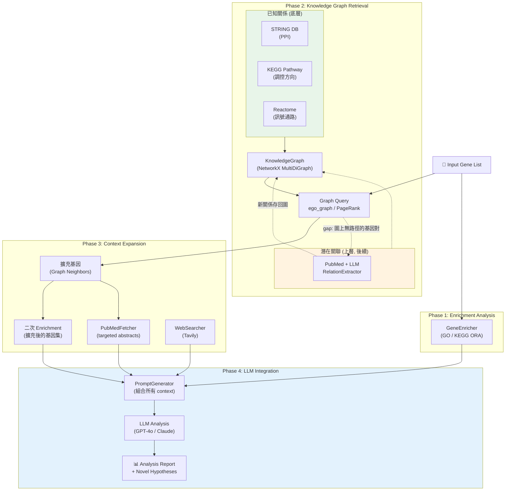

# EnrichRAG

**EnrichRAG is a modular framework that performs canonical gene set enrichment and extends it with knowledge graph retrieval, literature augmentation, and LLM-based interpretation.**

核心概念：從一群基因出發，透過多種手段（enrichment、knowledge graph、文獻檢索）擴充上下文，再用 LLM 做整合分析與未知探索。

---

## Architecture



---

## Problem Statement

給定一組基因（gene set），研究者希望知道：

1. 這組基因在**哪些生物功能／路徑中顯著富集**
2. 不同資料庫（GO、KEGG…）的結果是否**一致或互補**
3. 是否存在**文獻支持的隱含關聯**，解釋這些富集結果的生物學脈絡

### 現有方法的限制

* 傳統 enrichment（ORA / GSEA）：結果分散在多個資料庫，缺乏整合與語境解釋
* 文獻閱讀：高成本、不可重現
* LLM 直接生成：缺乏可驗證的基礎結果

---

## Modules

### Enrichment Layer

| Module | Description | Status |
|--------|-------------|--------|
| **GeneEnricher** | ORA analysis (GO/KEGG) with gseapy | ✅ Done |
| **PromptGenerator** | YAML template + LangChain LCEL | ✅ Done |

### Retrieval Layer

| Module | Description | Status |
|--------|-------------|--------|
| **PubMedFetcher** | Entrez API abstract retrieval | ✅ Done |
| **WebSearcher** | Tavily Search integration | ✅ Done |
| **RelationExtractor** | LLM-based relation extraction (Pydantic structured output) | ✅ Done |

### Knowledge Graph Layer

| Module | Description | Status |
|--------|-------------|--------|
| **KnowledgeGraph** | NetworkX MultiDiGraph wrapper with graph query | Planned |
| **STRING DB importer** | PPI edges (`type="ppi"`) | Planned |
| **KEGG Pathway importer** | Directed regulatory edges (`type="pathway"`) | Planned |

### LLM Integration

| Module | Description | Status |
|--------|-------------|--------|
| **LLM Chain** | GPT-4o / Claude with StrOutputParser | ✅ Done |

### Web UI & Visualization

| Feature | Description | Status |
|---------|-------------|--------|
| **Web Interface** | FastAPI + SSE streaming pipeline | ✅ Done |
| **Gene Validation** | Canonical gene normalization with accepted / remapped / rejected summaries | ✅ Done |
| **Pipeline Flowchart** | Animated node states with per-step timers | ✅ Done |
| **Network Graph** | D3.js force-directed graph (zoom/pan, color-coded entities) | ✅ Done |
| **Report Rendering** | Markdown → styled HTML with Lora serif typography | ✅ Done |
| **Tabbed Results** | Enrichment tables, sources, relations, insights | ✅ Done |
| **Analysis Chat Assistant** | Result-grounded chat drawer with streaming answers and suggested questions | ✅ Done |
| **History Management** | Load, delete, and clear authenticated server-side analysis history | ✅ Done |
| **Vue Web UI** | Dedicated `/ui-vue` frontend for the modular Vue-based interface | ✅ Done |

---

## Core API

```python
enrich(gene_set: List[str]) -> EnrichmentReport
```

### EnrichmentReport schema

```json
{
  "input_genes": [...],
  "databases": ["GO", "KEGG"],
  "results": {
    "GO": [...],
    "KEGG": [...]
  }
}
```

### Relation Table schema

```
| Source Gene | Target Gene | Relation | Type    | Source DB | Evidence                        |
|-------------|-------------|----------|---------|-----------|---------------------------------|
| TP53        | EGFR        | up       | pathway | KEGG      | KEGG:hsa05200                   |
| TP53        | MDM2        | up       | ppi     | STRING    | combined_score=0.999            |
| RBM10       | MYC         | down     | llm     | PubMed    | "...inhibiting transcription..." |
```

---

## Roadmap

### v0.1 - Core Framework ✅

- [x] **GeneEnricher**: ORA analysis (GO/KEGG)
- [x] **PromptGenerator**: YAML template + LangChain LCEL
- [x] **LLM Integration**: GPT-4o chain with StrOutputParser
- [x] **WebSearcher**: Tavily Search integration
- [x] **PubMedFetcher**: Entrez API abstract retrieval
- [x] **RelationExtractor**: LLM-based relation extraction with Pydantic structured output

### v0.2 - Web UI & Pipeline Integration ✅

- [x] **Web UI**: FastAPI backend + single-page frontend with SSE streaming
- [x] **Gene Validation**: Normalize symbols before analysis with accepted / remapped / rejected feedback
- [x] **Pipeline Orchestration**: Enrichment → parallel search (Web + PubMed) → relation extraction → LLM synthesis
- [x] **Animated Pipeline Flowchart**: Real-time node status with elapsed timers, timeout/failure states
- [x] **D3 Network Graph**: Force-directed visualization with zoom/pan, lazy rendering
- [x] **Report Typography**: Lora serif font, wider layout, structured Markdown headings
- [x] **Relations in LLM Prompt**: Extracted biomedical relations fed into analysis for richer interpretation
- [x] **Result-grounded Chat Assistant**: Full-result chat context, streaming responses, and suggested follow-up questions
- [x] **History Controls**: Authenticated users can reload, delete individually, or clear server-side saved analyses
- [x] **Vue Web UI**: Vue SPA served at root `/`
- [x] **CLI Interface**: `enrichrag` command via Typer

### Frontend Notes

- Application route: `/` (Vue 3 SPA, legacy static frontend removed)
- Analysis history is stored server-side in SQLite and scoped to the authenticated user
- Authentication uses an `HttpOnly` session cookie with `SameSite=Lax`
- Chat answers are grounded in the current analysis result payload rather than an external database lookup

### v0.2.2 - Network Graph, Pipeline & Frontend Overhaul ✅

**Knowledge Graph & Relations**
- [x] **Relation taxonomy**: normalized all KG sources (STRING, KEGG, Reactome, PubTator) with unified edge schema
- [x] **Network presets**: Overview, Gene Relations, Bio Terms, Disease Context, Custom — with hierarchical relation type filters
- [x] **Graph edge sanitization**: deduplicated edges, cleaned invalid values
- [x] **Enrichment filter fix**: enrichment edges now correctly show in all presets (not just Bio Terms)

**Pipeline & UI Polish**
- [x] **Pipeline viz redesign**: new topology layout, state machine fixes, mobile rail
- [x] **Chat drawer polish**: improved UX for results workspace and network tab
- [x] **Auth form**: 8-character password hint, tighter signup spacing
- [x] **Filter pill design**: capsule-style pills with partial state visual feedback

**Frontend Architecture**
- [x] **Single frontend**: removed legacy `/enrichrag/static`, promoted Vue SPA to root `/`
- [x] **Duplicate router removed**: deleted unused `src/router/index.ts`
- [x] **CSS modularized**: split 2179-line `components.css` into 14 domain-scoped files
- [x] **Inline styles eliminated**: all static `style=""` replaced with semantic CSS classes
- [x] **NetworkTab controls**: Advanced Filters auto-show on Custom preset, Reset pushed right, status bar simplified
- [x] **Graph performance**: 80% pre-computed layout with settle animation, fingerprint-based watcher + debounce

**Mobile**
- [x] **9-point mobile UX overhaul**: RUN PIPELINE button stacking, p-value nowrap, textarea height, tab scroll hint, chat bottom-sheet, 44px touch targets, enrichment table word-break, `.main` flex fix

### v0.3 - Knowledge Graph: 已知關係 (Next)

**KnowledgeGraph module**
- [ ] `KnowledgeGraph` class (NetworkX MultiDiGraph wrapper)
  - [ ] Unified edge schema: `(source, target, {type, direction, source_db, evidence, ...})`
  - [ ] `add_relations(df)` — batch add edges from DataFrame
  - [ ] `get_neighbors(gene, radius)` — ego subgraph
  - [ ] `rank_nodes(method)` — degree / PageRank
  - [ ] `to_context(genes)` — convert to text for prompt injection
  - [ ] Persistence: save/load GraphML or JSON

**Import known biological graphs**
- [ ] **STRING DB** — download TSV, import PPI edges (`type="ppi"`)
- [ ] **KEGG Pathway** — import directed regulatory edges (`type="pathway"`)
- [ ] **PubTator Central** — bulk co-occurrence edges from FTP. Provides low-cost, large-scale gene-gene and gene-disease co-occurrence relationships mined from PubMed abstracts.
- [ ] (optional) Reactome / DisGeNET

**Pipeline integration**
- [ ] `genes → KnowledgeGraph.get_neighbors() → expanded_genes`
- [ ] `expanded_genes → GeneEnricher (second-round enrichment)`
- [ ] `expanded_genes → PubMedFetcher (targeted search)`
- [ ] All context assembled → PromptGenerator → LLM

### v0.4 - Knowledge Graph: 潛在關聯 (Future)

**LLM-based Relation Extraction (on-demand)**
- [ ] Detect gaps: find gene pairs with no path in graph
- [ ] For gap pairs → PubMedFetcher → RelationExtractor → extract relations
- [ ] Store new relations back to KnowledgeGraph (graph grows with usage)
- [ ] Cache layer: avoid duplicate queries for same gene pairs

### v0.5 - Visualization Enhancements (Future)

**Enrichment Charts**
- [ ] Enrichment bar chart — top GO/KEGG terms sorted by -log10(p-adjusted)
- [ ] Dot plot — x=gene count, y=term, size=overlap ratio, color=p-value
- [ ] Gene-term heatmap — overlap matrix (genes × pathways)

**Network Graph Enhancements**
- [ ] Node sizing by degree / PageRank, edge coloring by relation type
- [ ] Interactive: hover to highlight neighbors, click to inspect evidence
- [ ] `/api/graph` endpoint — return graph JSON for frontend rendering

### v1.0 - Full Pipeline (Future)

- [ ] CLI: `enrichrag analyze --genes TP53 KRAS EGFR --disease cancer`
- [ ] Single command: enrich → graph expand → literature → LLM report
- [ ] PubMed query cache (SQLite/Parquet)
- [ ] (optional) Embedding index for semantic retrieval (ChromaDB)
- [ ] (optional) Neo4j to replace NetworkX for large persistent graphs

### Operations, Security, and Deployment

- [x] Store passwords as salted PBKDF2 hashes instead of plaintext
- [x] Use server-side session tokens rather than storing credentials in the browser
- [x] Store auth state in an `HttpOnly` cookie with `SameSite=Lax`
- [x] Scope saved analysis history to the authenticated user via `user_id`
- [x] Enforce owner checks when loading or deleting saved history items
- [x] Expire sessions server-side using `expires_at`
- [ ] Enable `Secure` cookies in production over HTTPS
- [ ] Add login rate limiting / brute-force protection on auth endpoints
- [ ] Add CSRF protection for cookie-authenticated state-changing requests if the app is exposed beyond a trusted same-site deployment
- [ ] Add account lifecycle controls such as password reset, email verification, or admin-managed provisioning if external users are expected
- [ ] Review session revocation strategy for multi-session management
- [ ] Review SQLite file permissions and deployment storage location for shared/lab environments
- [ ] Consider audit logging for sign-in, sign-out, registration, and destructive history actions
